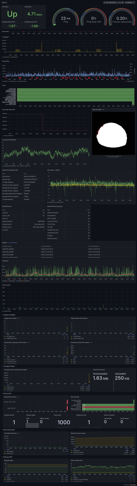

<p align="center">
  <h3 align="center">Starlink Prometheus Exporter Monitoring Stack</h3>
</p>

---

A [Starlink](https://www.starlink.com/) exporter for Prometheus. Not affiliated with or acting on behalf of Starlink(™)

This is a fork of [clarkzjw/starlink_exporter](https://github.com/clarkzjw/starlink_exporter) with Debian packaging, security hardening, and additional metrics.

[](https://github.com/brendanbank/starlink_exporter/actions/workflows/build.yaml)
[](/LICENSE)
[](https://github.com/brendanbank/starlink_exporter/releases/latest)


Original repositories:

- https://github.com/danopstech/starlink_exporter
- https://github.com/clarkzjw/starlink_exporter

---

Starlink gRPC protobuf for Golang: [clarkzjw/starlink-grpc-golang](https://github.com/clarkzjw/starlink-grpc-golang)

Starlink dish firmware tracking website: https://starlinktrack.com/firmware/dishy

---

## Installation

### Debian/Ubuntu (recommended)

Pre-built `.deb` packages are published with each release for amd64, arm64, and armhf (Raspberry Pi).

```bash
wget https://github.com/brendanbank/starlink_exporter/releases/latest/download/starlink-exporter_<version>_amd64.deb
sudo dpkg -i starlink-exporter_<version>_amd64.deb
```

The service is enabled and started automatically after installation.

See [PACKAGING.md](PACKAGING.md) for full build and publish instructions.

### Binaries

For pre-built binaries see the [releases](https://github.com/brendanbank/starlink_exporter/releases).

```bash
./starlink_exporter [flags]
```


## Usage

### Flags

`starlink_exporter` is configured through optional command line flags:

```bash
$ ./starlink_exporter -h
Usage of ./starlink_exporter:
  -address string
        IP address and port to reach dish (default "192.168.100.1:9200")
  -port string
        listening port to expose metrics on (default "9817")
```

The dish address can also be set with the `STARLINK_GRPC_ADDR_PORT` environment
variable, which takes precedence over `-address`. The container image and the
compose stack in [`contrib/`](contrib/) use it.

### Endpoints

| Path | Serves |
| --- | --- |
| `/metrics` | dish metrics, scraped continuously |
| `/infrequentMetrics` | `starlink_dish_public_ip_pop`, the dish's public IPv4/IPv6 address and PoP codes. Requires the `IFACE` environment variable naming the interface facing the dish; without it the endpoint returns nothing. It shells out to `curl` against an external service, so scrape it rarely (hourly is plenty) and from a separate job |
| `/health` | gRPC connection state to the dish: `200` idle or ready, `503` connecting or failed, `500` shut down |
| `/` | links to the above |

### Service management

```bash
sudo systemctl status starlink-exporter
sudo journalctl -u starlink-exporter -f
```

---

## Fork Changes

### New Prometheus Metrics

The following metrics have been added on top of upstream:

**Location**
- `starlink_dish_latitude` — dish latitude (degrees)
- `starlink_dish_longitude` — dish longitude (degrees)
- `starlink_dish_altitude` — dish altitude (meters)

Dishes increasingly refuse `GetLocation` by policy, in which case none of these
are exported. The exporter logs the refusal once and stops asking.

**Alignment**
- `starlink_dish_boresight_azimuth_diff_deg` — difference between desired and actual boresight azimuth
- `starlink_dish_boresight_elevation_diff_deg` — difference between desired and actual boresight elevation
- `starlink_dish_tilt_angle_deg` — dish tilt angle

**Signal Quality**
- `starlink_dish_snr_above_noise_floor` — despite the name, `1` means the SNR is **below** the noise floor, i.e. a signal problem. The name is inherited from upstream
- `starlink_dish_snr_persistently_low` — whether SNR is persistently low

**GPS**
- `starlink_dish_pnt_filter_convergence_state` — position/navigation/timing filter convergence state (`0` reset, `1` unconverged, `2` converged, `3` faulted, `4` invalid), with the name in a `pnt_filter_convergence_state` label

**Alerts**
- `starlink_dish_alert_no_ethernet_link` — no ethernet link detected
- `starlink_dish_alert_slow_eth_speeds_100` — ethernet negotiated at 100Mbps or below
- `starlink_dish_alert_dbf_telem_stale` — digital beamforming telemetry is stale
- `starlink_dish_alert_dish_water_detected` / `starlink_dish_alert_router_water_detected` — water ingress
- `starlink_dish_alert_upsu_router_port_slow` — UPSU router port below expected link speed

**Dish Status**
- `starlink_dish_initialization_duration_seconds` — time taken to initialize the dish
- Additional obstruction detail metrics
- Quaternion orientation values (ned2dish)
- `starlink_dish_dl_bandwidth_restricted_reason` / `starlink_dish_ul_bandwidth_restricted_reason` — why the dish is rate limited (`1` NO_LIMIT, `2` POLICY_LIMIT, `3` USER_CUSTOM_LIMIT, `5` OVERAGE_LIMIT, `6` LOW_SPEED_POLICY_LIMIT), with the name in a `reason` label
- `starlink_dish_reboot_reason`, `starlink_dish_swupdate_reboot_ready`, `starlink_dish_software_update_progress`, `starlink_dish_software_update_requires_reboot`, `starlink_dish_seconds_until_swupdate_reboot_possible`
- `starlink_dish_is_cell_disabled`, `starlink_dish_has_actuators`, `starlink_dish_is_moving_fast_persisted`, `starlink_dish_high_power_test_mode`, `starlink_dish_has_signed_cals`, `starlink_dish_user_debug_mode_enabled`, `starlink_dish_mac_flag`, `starlink_dish_nat_flag`, `starlink_dish_account_shard`
- `starlink_dish_connected_routers` / `starlink_dish_downstream_routers` — router counts
- `starlink_dish_gps_no_sats_after_ttff`, `starlink_dish_gps_inhibited`

**Power Accessories**
- `starlink_dish_plc_*` — PLC accessory state of charge, battery health, thermal throttle level, safety mode, per-port power
- `starlink_dish_battery_state_of_charge`, `starlink_dish_battery_is_charging`, `starlink_dish_battery_power_source`
- `starlink_dish_upsu_dish_power_watt`, `starlink_dish_upsu_router_power_watt`, `starlink_dish_upsu_uptime_seconds`, `starlink_dish_aps_dish_power_watt`, `starlink_dish_aps_uptime_seconds`

**Diagnostics**
- `starlink_dish_hardware_self_test` — self test result, with the name in a `result` label
- `starlink_dish_hardware_self_test_code` — one series per reported failure code
- `starlink_dish_stowed` — dish is stowed
- `starlink_dish_overage_rate_limited` — rate limited because the data allowance was exceeded

**History**

The dish keeps ~15 minutes of per second samples. Scraping only reads instantaneous
values, so anything that happens between two scrapes is invisible; these metrics
aggregate the whole buffer on every scrape.

- `starlink_dish_history_samples` — samples aggregated
- `starlink_dish_history_pop_ping_drop_rate_avg`, `starlink_dish_history_full_drop_seconds`, `starlink_dish_history_partial_drop_seconds`, `starlink_dish_history_longest_full_drop_seconds`
- `starlink_dish_history_pop_ping_latency_seconds_avg` / `_min` / `_max` — fully dropped seconds excluded
- `starlink_dish_history_downlink_throughput_bps_avg` / `_max`, `starlink_dish_history_uplink_throughput_bps_avg` / `_max`
- `starlink_dish_history_downlink_bytes`, `starlink_dish_history_uplink_bytes` — volume over the window
- `starlink_dish_history_power_watt_min` / `_max`
- `starlink_dish_history_outage_count` / `starlink_dish_history_outage_seconds` — per outage `cause`
- `starlink_dish_history_outage_max_seconds`, `starlink_dish_history_outage_switch_count`

**Device ID Label**

All metrics include a `device_id` label for identifying individual dishes when multiple units are monitored.

### Security Hardening

The service runs as a dedicated `starlink-exporter` system user (not root), with the following systemd security directives:

- `NoNewPrivileges=true`
- `PrivateTmp=true`
- `ProtectSystem=strict`
- `ProtectHome=true`

A state directory `/var/lib/starlink-exporter` is created on install and removed on purge.

### Build System

- `Makefile` updated for cross-compilation targeting Linux, macOS, and Windows (amd64, arm64, armhf)
- Optional UPX compression for binary size reduction
- Docker image building and Docker Hub publishing removed; releases are binary archives + `.deb` only
- GoReleaser builds the `.deb` packages through its `nfpms` section, in the same run that publishes the release

---

## Release History

See [CHANGELOG.md](CHANGELOG.md).

---

## Grafana Dashboard

Provisioned from `contrib/config/grafana/provisioning/dashboards/Starlink-exporter.json`.

<p align="center">
	
</p>
